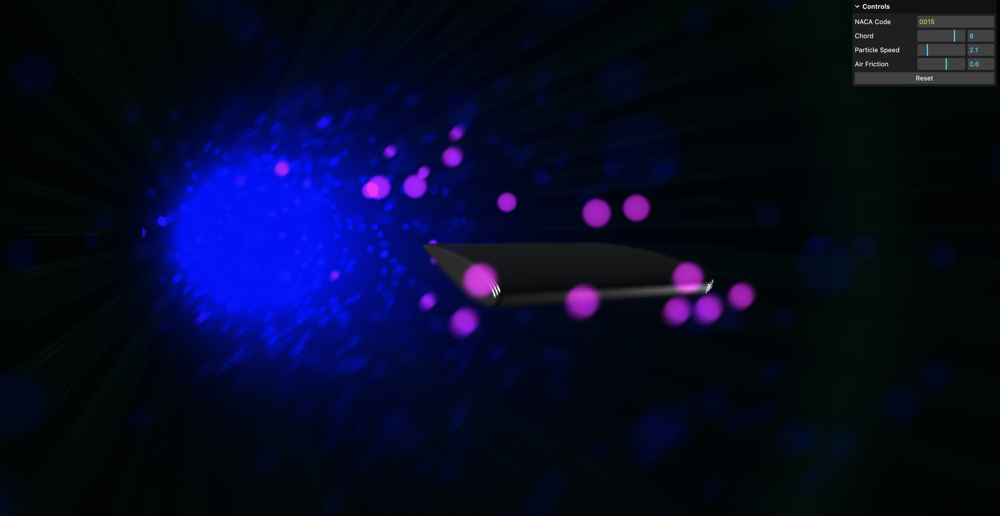

# NACA Airfoil

#### Create NACA airfoils in multiple vector formats and view them in the browser!



This project provides tools to generate NACA airfoil shapes, which are widely used in aerodynamics and engineering. You can create airfoil profiles in various vector formats. Additionally, you can visualize the generated airfoil shapes directly in your web browser for quick inspection and analysis.

### Features

- Generate precise NACA airfoil profiles based on user-specified parameters.
- Interactive browser-based visualization for real-time feedback.
- Easy-to-use interface for both beginners and advanced users.

### Getting Started

```bash
npm i naca-foil
```

### Applications

- Aerodynamic design and analysis.
- Educational purposes for understanding airfoil geometry.

### Coming soon

- Export airfoil shapes to multiple vector formats for use in CAD or other design tools.
- Integration into CAD workflows for engineering projects.

### Contributions

Contributions are welcome! Feel free to submit issues, feature requests, or pull requests to improve the project.


